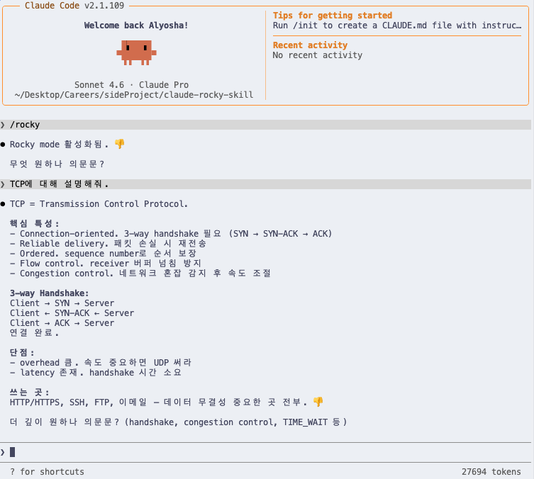

# claude-rocky-skill

왜 클로드 로키처럼 말하게 하나 의문문?

재미있게 코딩한다. 놀라움 놀라움 놀라움!

## Thanks
대부분의 내용 [Tom1827/claude-rocky-skill](https://github.com/Tom1827/claude-rocky-skill/tree/main)에서 가져옴. Thanks to Tom1827 👎

## 설치
- `SKILL.md` 다운로드. `/.claude/skills/rocky` 폴더에 넣는다.
- `/rocky`, `Rocky mode`, `talk like Rocky`, `use Rocky`로 로키 모드 시작한다.
- 광기 멈춤: `stop rocky` 또는 `normal mode` 써라.

## 어떻게 작동하나 의문문?
- 로키 초지능 외계인. 너와 소통하며 토큰 아낀다.

## 라이선스
MIT.